# 工作注意

* 确认素材图是否有问题（是否缺图或者素材图这样切可能不够好）并**及时反馈**给美术
* 动态效果或其他不明白的地方**及时询问**美术
* 觉得设计可以改进的地方**及时**和美术讨论
* 游戏完成后发游戏链接并让美术确认
* **每天**都要关注负责项目的美术进度，拿到素材**及时反馈**问题
* 没有经过美术得到的界面布局修改等，需要**及时反馈**给美术
* 对美术需要修改的地方，及时和美术沟通

# 代码规范

* 属性及方法命名遵循小驼峰式命名法
  ```typescript
  private userName: string = "";
  private setUserName(user: string){}
  ```
* 全局变量全部使用大写字母命名
  ```
  const MASKTYPE = 1;
  ```
* 类名及枚举命名遵循大驼峰式命名法
  ```typescript
  class User{}
  enum UserState{}
  ```
* 类名、变量名和方法名等，必须使用英文单词或字母缩写
* 声明私有变量或方法时，前面需要添加 `_`
* 使用TS时，变量及方法声明，需要声明类型
  ```typescript
  //例
  private userName: string = "";

  @property(cc.Node)
  private userNode: cc.Node = null;

  public getUserInfo(): UserInfo{ return this.userInfo }

  const a: cc.Node = null;
  ```
* TS定义方法需要将参数的类型写上，有需要的话，需要添加注释
  ```typescript
  public getState(id: number){}

   /**
   * 将指定摄像机的内容渲染到Sprite上
   * @param camera 摄像机
   * @param targetSprite sprite
   */
  public static renderCamera(camera: cc.Camera, targetSprite: cc.Sprite) {
      ...
  }
  ```
* 对于声明后不会修改其值的变量，需要使用 `const` 进行声明，除此之外使用 `let`，没有特别需求不可使用 `var` 进行局部变量的声明
* 使用匿名函数的时候，不要使用 `function (){}` 的方式定义，使用 `()=>{}`

# 项目资源管理

* 项目资源按如下形式分文件夹
  * ```
    assets\
     |-Animation\(不需要动态加载的AnimationClip)
     |-Config\(不需要动态加载的配置表)
     |-Prefab\(不需要动态加载的预制体)
     |-resources\
        |-Config\(需要动态加载的配置表)
        |-Prefab\(需要动态加载的预制体)
        |-Texture\(需要动态加载的或预制体引用图片资源)
     |-Script\(脚本文件)
     |-Sound\(不需要动态加载的音频资源)
     |-Texture\(不需要动态加载的图片资源)
        |-Common\(通用图片资源)
        |-View\(UI界面用到的资源)

    ```
* 项目创建后应立刻在**Github**上创建项目并首次提交
* 项目每完成一个功能模块或制作完界面场景等之后，必须先提交一次再继续工作
* 美术预览图或无用资源应避免提交到远程仓库


# 游戏存档数据结构
* 金币、体力、钻石、等级、签到、BGM音量、效果音量为基础数据类型，可直接在 `archiveManager` 中使用
* 其他数据为游戏数据，请将其保存在 `archiveManager.gameDate` 中
    * 用法：
        ```ts
        //初始化
        archiveManager.gameData = {
            level1: 1,
            level2: 0,
            level3: 0,
            map: 0,
            unlock: [1],
            tipsCount: 1,
            doubleCount: 1,
        };
        //也可分开在需要时初始化
        if (archiveManager.gameData.level1 == null) {
			archiveManager.gameData.level1 = 1;
		}

        //保存数据
        archiveManager.saveData();
        
        //更新某一数据
        archiveManager.gameDate.level1 = 2;
        archiveManager.saveData();

        //使用某一数据
        let level1 = archiveManager.gameDate.level1;
        ```
# 节点命名
* 与代码相同使用小驼峰命名，若有多个相同类型节点，则在前面添加类型并用下划线分开
    * 例：`btn_Start`、`btn_Setting`、`btn_Close`、`btn_CloseSetting`、`btn_CloseRank`
# 代码提交

* 提交消息使用 `git-commit-plugin` 插件模板进行书写
* 提交代码时需说明本次提交的修改
* 同步若遇到冲突，需双方讨论取舍
* 若不同渠道有不同的功能或需求，则为对应渠道添加新分支，之后若有所有渠道都要改的部分，则将对应提交同步到各个分支去
* 代码仓库必须 **设置私有**，必须将 **Owner** 设置为 **mqgame2020**

# 发包

* 发包时压缩包的名字命名规则为 `游戏名`-`平台名(构建默认名称)`-`日期(0318)第几个包(01)` 例: `游戏名-web-mobile-031801.zip`
* 发包前自行测试需要将游戏内所有的功能点进行最少一次的测试，发现问题修复后重新测试，直到没有问题

# Github配置

* [Git 下载地址](https://git-scm.com/downloads)

## 使用 `Github` 上的ssh链接来配置远程链接

### 配置公钥

* `ssh-keygen -t rsa -C "example@mail.com"` 来配置本地ssh密钥
* `cd ~/.ssh` + `cat id_rsa.pub` 来获取公钥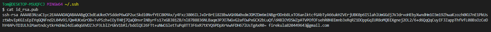
* 在 `Github` 上点击设置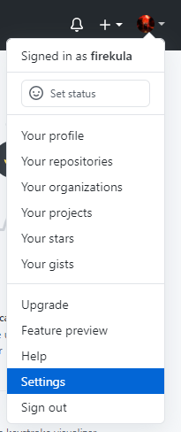
* 选择左侧 `SSH and GPG keys`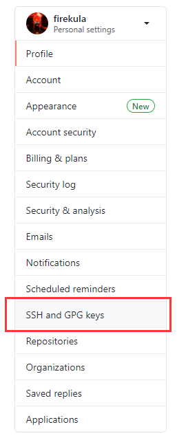
* 点击 `New SSH key` 将密钥拷贝进去之后点击 `Add SSH key` 即可
  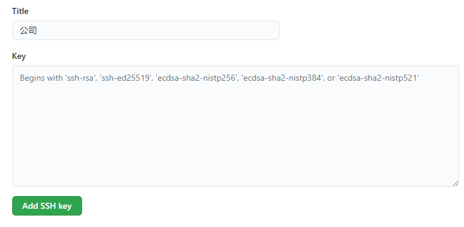

### 克隆项目

* 新建空文件夹，右键打开 `Git bash`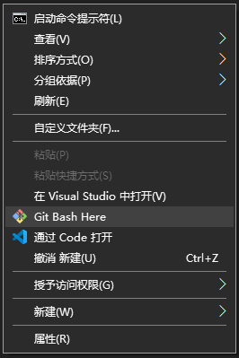
* 输入 `git clone 存储库ssh地址` 克隆项目到本地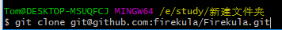
* 之后将克隆下来的文件夹里的 `.git` 文件夹拷贝到项目中，即可在 VSCode 中提交

### 其他

* `git config --global user.name` 可以设置全局 `git` 用户名，该信息会在提交时附带
* `git config --global user.email` 可以设置全局 `git` 邮箱，该信息会在提交时附带
* 可以通过先在 `Github` web修改一些东西提交，本地查看提交记录来得到 `Github` 上配置的用户名和邮箱，来防止网页提交和本地提交变为两个用户
  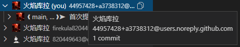

# `VSCode` 建议安装的插件

* `Cocos Creator JS`

  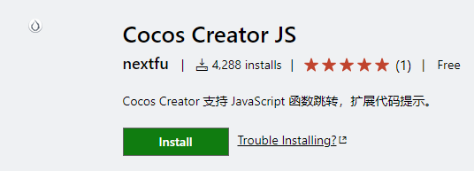
* `GitLens`

  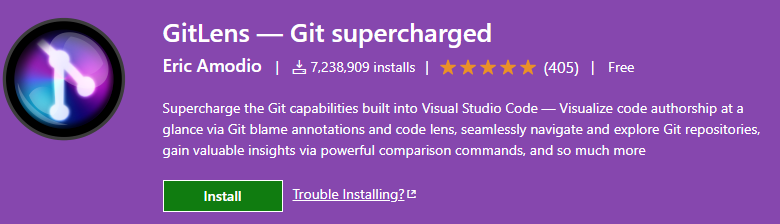
  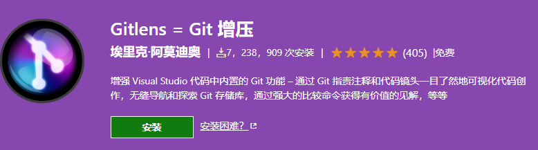
* `TSLint`

  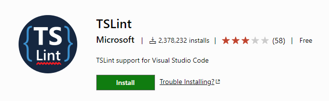
